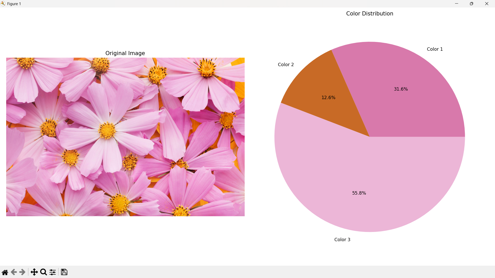

# 🎨 Image Dominant Color Detector

A simple Python project to detect the dominant color in an image using OpenCV, KMeans Clustering, and Matplotlib.

---

## 📦 Features

- Detects the most dominant color in any image.
- Displays the original image.
- Shows a pie chart of color distribution.
- Outputs the dominant color's RGB value in the terminal.

---

## 🛠️ Requirements

- Python 3.x
- OpenCV
- NumPy
- scikit-learn
- Matplotlib

---

## 📥 Installation

Install the required libraries using pip:

```bash
pip install opencv-python numpy matplotlib scikit-learn

🚀 How to Run
-Place your image in the project folder and rename it to test.jpg.

-Open your terminal in the project directory.

-Run the Python script:
```bash
   python colordetection.py

The program will display:

 -The original image.

 -A pie chart showing color distribution.

 -The dominant color's RGB value in the terminal.  

## 📸 Screenshot

 